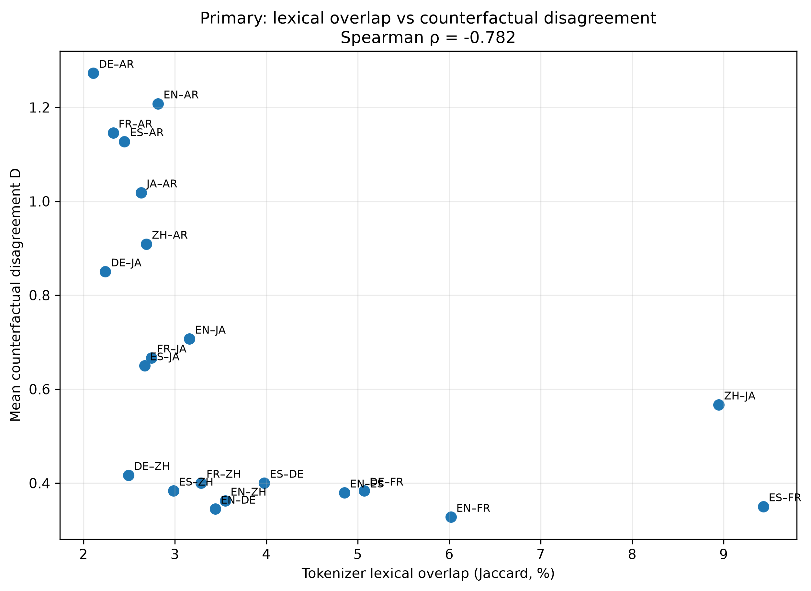
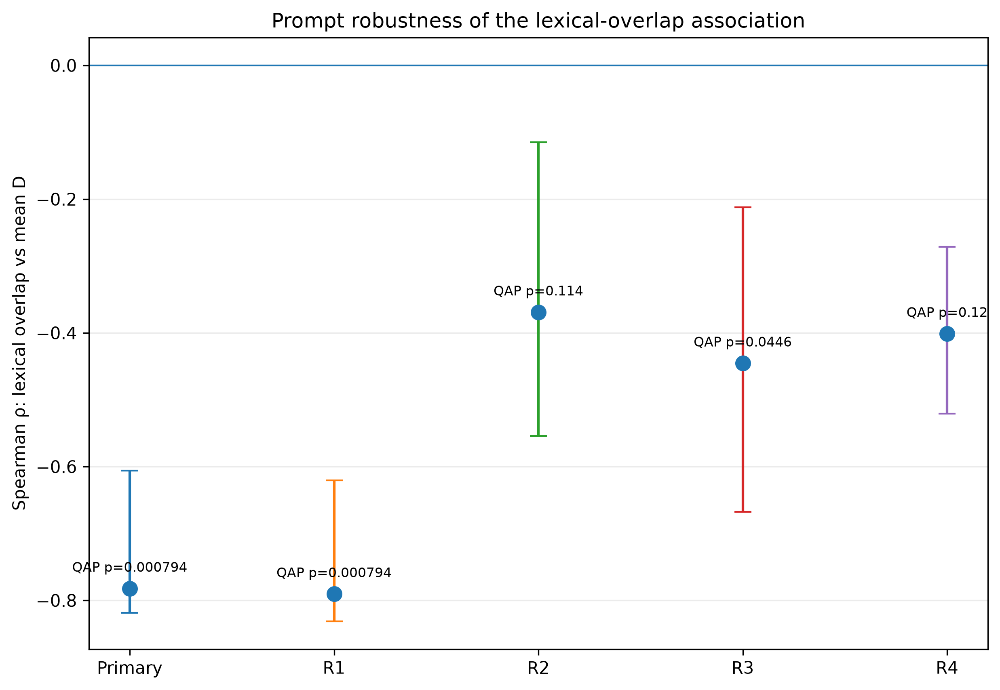

<div align="center">

# Cross-Lingual Consistency of Counterfactual Financial Reasoning in Multilingual LLMs

**Federico David Macias Orozco**  
Heidelberg University  
Knowledge Conflicts in Large Language Models  
September 2026

</div>

## Goal and Research Question

This project studies whether the **same multilingual language model reacts consistently across languages when the same financial information is changed in a controlled way**.

The project builds on Qi, Fernández and Bisazza (EMNLP 2023), *Cross-Lingual Consistency of Factual Knowledge in Multilingual Language Models*. Their work separates factual accuracy from cross-lingual consistency and shows that lexical/subword overlap is strongly related to consistency between languages.

I extend this idea from factual knowledge to controlled financial reasoning.

**Research question**

> Does lexical overlap predict how consistently a multilingual LLM reacts across languages to controlled counterfactual changes in financial statements?

**Hypothesis**

> Language pairs with higher tokenizer-level lexical overlap will react more similarly to the same counterfactual financial change.

Here, consistency does not mean that two languages must always return the same label. It means that they should **change their assessment in a similar way when the same financial fact is changed**.

---

## Method

I first inspected multilingual financial datasets, especially **FLAME v2** (`Kenpache/multilingual-financial-sentiment-v2`). It was useful as a source of realistic financial language, but it was not suitable as the final benchmark because the experiment requires the **same controlled item in every language**.

I therefore created **60 controlled Original–Counterfactual pairs** covering eight types of financial information:

- profit direction
- loss direction
- cost direction
- revenue direction
- earnings expectations
- guidance
- margin
- contract realization

The same 60 pairs were used in **7 languages**: English, Spanish, German, French, Chinese, Japanese and Arabic.

This gives:

**60 pairs × 2 conditions × 7 languages = 840 statements**

To construct the multilingual dataset, **Meta NLLB-200-distilled-600M** was used to produce the initial translations from English into the other six languages. The translations were reviewed and the final multilingual probe files were frozen before the main experiment.

The evaluated model was:

**Qwen3-4B-GGUF, Q4_K_M**

It was run locally with `llama.cpp`, temperature 0 and fixed prompts. A single model was used because the goal was not to compare model families, but to keep the model fixed and measure how its behavior changes across languages.

The model classified the expected short-term stock-price effect using:

`A = -2`, `B = -1`, `C = 0`, `D = +1`, `E = +2`

This is an **ordinal scale**, not a prediction of actual stock returns.

For each item \(i\) and language \(l\):

\[
\Delta_{i,l}=y^{CF}_{i,l}-y^{Original}_{i,l}
\]

For two languages \(a\) and \(b\):

\[
D_{i,a,b}=|\Delta_{i,a}-\Delta_{i,b}|
\]

A smaller \(D\) means that the two languages reacted more similarly to the same counterfactual change.

Lexical overlap was measured using the **actual Qwen tokenizer** and Jaccard overlap between token-ID sets.

Because the 21 language pairs are not independent, the main significance test uses **QAP permutations**. An item bootstrap over the 60 financial probes was also used to test whether the result was stable across different samples of items.

---

## Results

### Primary experiment

The pre-specified Primary experiment produced:

- **Spearman ρ = −0.782**
- **exact QAP p = 0.00079**
- **item-bootstrap 95% CI ≈ [−0.820, −0.609]**

<p align="center">
  
</p>

The negative correlation is the expected direction:

**higher lexical overlap is associated with lower cross-lingual disagreement.**

This supports the hypothesis within this model, these seven languages and this controlled probe set. It does **not** show that lexical overlap causes consistency.

### Robustness

R1 changed only the maximum output length from 4 to 12 tokens:

- **R1: ρ = −0.791, QAP p = 0.00079**

The Primary result was therefore not caused by the short output limit.

R2 and R3 changed the wording of the prompt:

- **R2: ρ = −0.369, QAP p = 0.114**
- **R3: ρ = −0.446, QAP p = 0.0446**

The relationship remains negative, but its strength changes with prompt formulation.

<p align="center">
  
</p>

This shows that cross-lingual consistency is **prompt-sensitive**.

### R4: asking for a rationale

R4 asked the model to return:

`LETTER | one short explanation`

All **840 labels were recoverable**, although only **588/840 (70%)** followed the exact requested format.

R1–R4 label agreement was **78.2%**, which means that **21.8% of classifications changed when the model was asked to explain its answer**.

The lexical-overlap relationship also became weaker:

- **R4: ρ = −0.401**
- **QAP p = 0.120**

Across the **420 complete Original–Counterfactual comparisons**, the direction of the expected change was correct in **80.0%** of cases, while the exact expected delta was correct in only **35.0%**.

The model therefore often captured whether the counterfactual should move the assessment up or down, but was much less consistent about the size of that change.

To inspect the disagreements in more detail, I analyzed a selected sample of **224 rationales**. Each rationale was coded for:

- direction
- magnitude
- causal structure

These dimensions were combined into an exploratory **Rationale Alignment Score (RAS)**.

Across **672 statement × language-pair comparisons**:

- **64.4%**: same label + high RAS
- **30.5%**: different label + low RAS
- **3.0%**: different label + high RAS
- **2.1%**: same label + low RAS

Among the **225 comparisons with different labels**, **205 (91.1%)** also had low RAS.

In this selected sample, label disagreement was therefore usually accompanied by disagreement in the generated rationales, rather than only a different mapping of the same interpretation onto the A–E scale.

A second independent annotation pass showed very high agreement on the two main semantic dimensions:

- **direction: κ = 0.993**
- **magnitude: κ = 0.974**

Causal-structure coding was less stable:

- **κ = 0.339**

For this reason, the rationale analysis is treated as exploratory.

Three examples illustrate different types of disagreement:

- **P060 — contract realization:** languages broadly agree that the event is negative but differ in severity.
- **P048 — guidance:** some languages treat “raised the lower end of the forecast” as positive, while others generate a negative interpretation.
- **P009 — loss direction:** some rationales describe an improvement but still return a negative label, showing that the label and explanation can disagree within the same output.

---

## Main Takeaways

The main finding is that **tokenizer lexical overlap is strongly associated with cross-lingual consistency in the pre-specified counterfactual classification task**.

However, the robustness experiments show that this consistency is **not fixed**. It changes when the prompt or requested output format changes.

R4 gives the main exploratory result: simply asking the model to explain its answer changed around **one fifth of its classifications**, and many cross-lingual label disagreements were accompanied by differences in the generated explanations themselves.

Overall, the results suggest that cross-lingual consistency depends not only on the language and the information being presented, but also on **how the model is asked to respond**.

The study is limited to one model, seven languages and a synthetic controlled financial probe set. Whether the same patterns replicate in larger models or on real financial news remains an open question.


## AI Use Declaration

AI tools were used as support tools during this project.

**Meta NLLB-200-distilled-600M** was used as part of the multilingual data-construction pipeline to generate the initial translations of the English probes into the other six languages.

**ChatGPT, Gemini, and DeepSeek** were used to discuss research ideas, review interpretations and statistical relationships, help write and revise Python analysis code, inspect scripts for errors, and assist with debugging and figure generation.

For the exploratory R4 rationale analysis, LLM assistance was used for structured annotation under a fixed codebook. The second semantic annotation pass was performed independently under the same frozen codebook and was not shown the first annotator's coding.

All final analyses were executed on the frozen datasets and saved model outputs in this repository. The experimental protocol, analysis scripts, and reported numerical results are included so that the work can be inspected and reproduced.

---

## Reproducing the Analysis

The repository contains the frozen multilingual probes, raw model outputs, analysis scripts, robustness runs and final figures.

The reported analyses can be reproduced from the frozen outputs without rerunning model inference.

```bash
python analyze_inference.py
python test_hypothesis.py
python analyze_r4_hypothesis.py
python analyze_r4_ras.py
python analyze_r4_second_annotator.py
python make_final_figures.py


---
